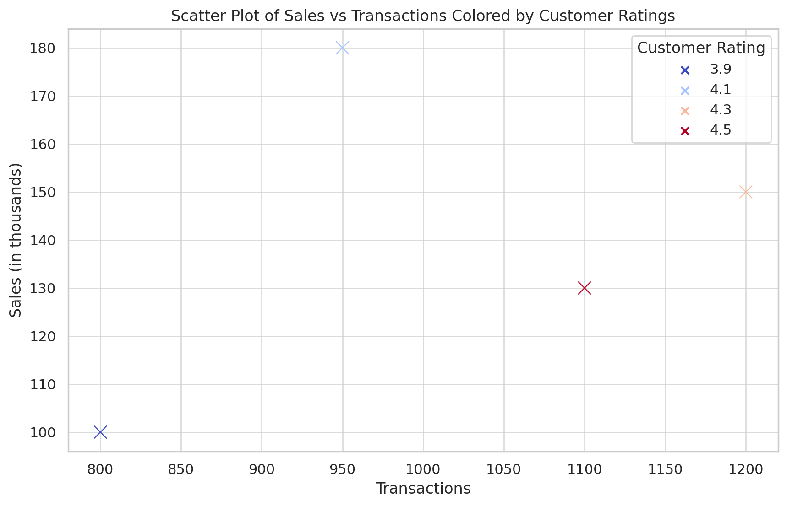

# Prompt Mühendisliği Kursu

Bu readme, [Prompt Mühendisliği Kursu](https://www.udemy.com/course/chatgpt-prompt-muhendisligi) için oluşturulmuştur, kursa kendiniz göz atabilir veya kursla birlikte inceleyebilirsiniz.

# ChatGPT'ye Göre Prompt Mühendisliği Temelleri

ChatGPT gibi AI dil modelleriyle etkileşimde bulunurken prompt mühendisliği kritik bir beceridir. Bu, AI'ın istenen çıktıyı üretmesini etkin bir şekilde yönlendiren promptların hazırlanmasını içerir. İşte prompt mühendisliğinin beş temeli ve açıklamaları:

1. **Açıklık ve Özgüllük**:
   - Sorulan şey açık ve özgül olmalıdır. Belirsiz veya muğlak promptlar, alakasız veya genel yanıtlara yol açabilir. Özgül olmak, AI'ın odaklanmasını daraltmaya ve daha doğru ve alakalı yanıtlar almanıza yardımcı olur.

2. **Bağlamsal Bilgi**:
   - Kompleks veya ince ayrıntılı sorgular için gerekli arka plan bilgisinin veya bağlamın sağlanması esastır. Bu, AI'ın senaryoyu veya sorunun hangi açıdan geldiğini anlamasına yardımcı olur ve daha doğru ve özel yanıtlara yol açar.

3. **Amaç ve Hedef Odaklılık**:
   - Promptun açık bir amacı ve hedefi olmalıdır. Bilgi aramak, yaratıcı içerik üretmek, bir problemi çözmek veya bir konsepti keşfetmek olsun, prompt bu belirli hedefe yönelik olmalıdır.

4. **Yapılandırılmış Yaklaşım**:
   - Yapılandırılmış çerçeveler kullanmak

(RGC, ICE veya Kısıtlama Odaklı Çerçeveler gibi) promptların etkinliğini önemli ölçüde artırabilir. Bu yapılar, AI'ın yanıtlarını sistematik bir şekilde yönlendirmeye ve sorgunun tüm ilgili yönlerini ele almaya yardımcı olur.

5. **İteratif İyileştirme**:
   - Prompt mühendisliği genellikle iteratif bir süreçtir. AI'ın ilk yanıtları, sonraki promptları daha kesin sonuçlar için nasıl yeniden formüle edebileceğiniz veya iyileştirebileceğiniz konusunda fikir verebilir. Bu, yanlış anlamaları açıklığa kavuşturmak, daha fazla ayrıntı eklemek veya sorgunun odak noktasını değiştirmek anlamına gelebilir.

Bu temeller, kullanıcıların ChatGPT gibi AI modelleriyle daha üretken ve anlamlı bir şekilde etkileşimde bulunmalarını sağlayan etkili prompt mühendisliğinin temel taşlarıdır. Bu ilkeleri uygulayarak kullanıcılar, AI'ın yanıtlarının kalitesini ve genel etkileşim deneyimini önemli ölçüde artırabilir.

## Prompt Mühendisliğinde İyi Uygulamalar

AI modellerinden en iyi olası yanıtları elde etmek için etkili prompt mühendisliği kritik öneme sahiptir. İşte bazı ana iyi uygulamalar ve örnekler:

### 1. **Açık, Kısa Sorularla Başlayın**:
   - **Uygulama**: Anlaşılır dil kullanın ve gereğinden fazla karmaşık cümlelerden kaçının.
   - **Örnek**: 
     - Daha Az Etkili: "Bir sunum hazırlamam gerekiyor, içinde önemli şeyler var, bana yardımcı olur musun?"
     - Daha Etkili: "Yarın 10 dakikalık bir sunum yapacağım. Konu: 'Prompt mühendisliğinde netlik'. Hedef kitle: yeni başlayanlar. 6 slaytlık akış ve her slayt için 2 madde önerir misin?"

### 2. **Yeterli Bağlam Sağlayın**:
   - **Uygulama**: Promptlarınıza gerekli arka plan bilgilerini dahil edin.
   - **Örnek**:
     - Daha Az Etkili: "Bu iş için bana bir yol haritası çıkar."
     - Daha Etkili: "Bir online kurs hazırlıyorum. Hedef: 2 haftada ilk versiyonu yayınlamak. Günde 2 saat çalışabiliyorum. Konular: prompt temelleri, örnekler, mini ödevler. Bana 14 günlük plan çıkar: her gün hedef + yapılacaklar + teslim çıktısı."

### 3. **Taleplerinizde Özgül Olun**:
   - **Uygulama**: Ne istediğinizi net bir şekilde tanımlayın, böylece kesin yanıtlar alın.
   - **Örnek**:
     - Daha Az Etkili: "Bana pazarlama önerileri ver."
     - Daha Etkili: "Bir mobil uygulamam var: günlük alışkanlık takibi. Hedef kitle: üniversite öğrencileri. Instagram için 7 günlük içerik planı üret: her gün 1 post fikri + 1 reels fikri + kısa metin taslağı."

### 4. **Belirli Bilgiler için Kapalı Uçlu Sorular Kullanın**:
   - **Uygulama**: Belirli, öz bilgiler gerektiğinde kapalı uçlu sorular sorun.
   - **Örnek**:
     - Daha Az Etkili: "Bu metni değerlendirir misin?"
     - Daha Etkili: "Aşağıdaki metin bir LinkedIn postu. 1–10 arası puan ver (netlik, değer önerisi, akıcılık). Sadece puanları yaz. Metin: '...'"

### 5. **Keşif için Açık Uçlu Soruları Kullanın**:
   - **Uygulama**: Geniş bir fikir yelpazesi veya yaratıcı girdi aradığınızda açık uçlu sorular kullanın.
   - **Örnek**:
     - Daha Az Etkili: "Bana içerik fikri ver."
     - Daha Etkili: "Prompt mühendisliğiyle ilgili, yeni başlayanların sık yaptığı hataları anlatan 12 içerik fikri üret. Her fikir için: başlık + 1 cümle açıklama + önerilen format (tweet/video/blog)."

### 6. **Promptlarınızı İteratif Olarak İyileştirin**:
   - **Uygulama**: AI'ın yanıtlarını kullanarak promptlarınızı iyileştirin ve yönlendirin.
   - **Örnek**:
     - İlk Prompt: "Bir e-posta yazmama yardım eder misin?"
     - Takip Promptu (ilk yanıttan sonra): "Konu: geciken teslimat için özür. Ton: kısa, profesyonel, suçlayıcı değil. 2 paragraf + 'sonraki adımlar' için 3 maddelik liste ekle. 120–160 kelime arası yaz."

### 7. **Önyargılı veya Yönlendirici Prompt'lardan Kaçının**:
   - **Uygulama**: AI'ı önyargılı veya önceden belirlenmiş bir yanıta yönlendirmeyecek tarafsız prompt'lar hazırlayın.
   - **Örnek**:
     - Daha Az Etkili: "Uzaktan çalışma neden kesinlikle daha verimlidir?"
     - Daha Etkili: "Uzaktan çalışmanın verimlilik üzerindeki etkisini artılar/eksiler olarak değerlendir. Hangi koşullarda verim artar, hangi koşullarda düşer? Somut örnekler ver."

### 8. **AI'nın Yeteneklerini ve Sınırlamalarını Göz Önünde Bulundurun**:
   - **Uygulama**: Protmp'larınızı, AI modelinin gerçekçi olarak başarabilecekleriyle uyumlu hale getirin.
   - **Örnek**:
     - Daha Az Etkili: "İnternetten en güncel kaynakları bul ve bana kesin bilgi ver."
     - Daha Etkili: "Aşağıdaki metne dayanarak 6 maddelik özet çıkar. Metinde olmayan bilgi ekleme. Metin: '...'"

### 9. **AI'nın Yanıtlarındaki Belirsizlikleri Açıklığa Kavuşturun**:
   - **Uygulama**: AI'nın yanıtlarında belirsizlikler veya belirsizlikler varsa, açıklığa kavuşturmak için takip prompt'ları kullanın.
   - **Örnek**:
     - AI Yanıtı: "Bu hedefe göre strateji değişir."
     - Takip Sorusu: "Hedefim: e-posta listeme 30 günde 1.000 yeni kayıt. Bütçe: 0 TL. Kanal: Instagram ve YouTube. Bana 3 aşamalı plan öner (hafta hafta)."

### 10. **Detay ile Özlülüğü Dengeleyin**:
   - **Uygulama**: Bağlam için yeterli detay sağlayın, ancak AI'ı karıştırabilecek aşırı uzun prompt'lardan kaçının.
   - **Örnek**:
     - Daha Az Etkili: "Yeni bir ürün çıkaracağız; hedef kitle, fiyatlama, rakipler derken her şey birbirine girdi, bana genel bir şeyler söyle."
     - Daha Etkili: "Yeni ürün: kişisel bütçe takip uygulaması. Hedef kitle: yeni mezunlar. Rakipler: ücretsiz uygulamalar. İstediğim: 3 fiyatlandırma seçeneği + her biri için artı/eksi + hangisini önerdiğin ve neden."

Bu en iyi uygulamalar, kullanıcıların AI modellerinden daha doğru, alakalı ve yararlı yanıtlar almasını sağlayacak prompt'lar formüle etmesine yardımcı olur. Bu teknikleri uygulayarak, kullanıcılar AI ile etkileşimlerinin etkinliğini büyük ölçüde artırabilirler.

## Prompt Yönlendirme (Prompt Priming)

Prompt yönlendirme, ChatGPT gibi AI dil modelleriyle etkileşimde kullanılan bir tekniktir, burada ilk giriş veya "prompt" modeli özel bir şekilde "yönlendirmek" için tasarlanır. Bu yönlendirme, etkileşimin bağlamını veya tonunu belirler ve AI'nın yanıtlarını etkiler. Amaç, AI'yı yanıtlarında belirli bir stil, format veya içerik türüne yönlendirmektir. İşte iki örnek:

1. **Yaratıcı Yazı Yönlendirmesiz**:
   - Prompt: "Ejderhalar ve elfler hakkında bir hikaye yazın."
   - Bu prompt çok daha belirsiz, ortam, karakterler ve konu hakkında özel detaylar içermez. Sonuç olarak, AI genel bir fantezi hikayesi üretebilir, ancak mistik bir dünya, kayıp altın şehir ve Elara adında bir karakterin yolculuğu gibi zengin detaylı ve özel bir senaryo ile mutlaka uyumlu olmayabilir.

2. **Yaratıcı Yazı Yönlendirme**:
   - Prompt: "Ejderhalar ve elflerin barış içinde yaşadığı mistik bir dünyayı hayal edin. Bu dünyada, bilge bir ejderha tarafından korunan altından yapılmış kayıp bir şehir efsanesi var. Genç bir elf olan Elara'nın bu şehri bulmak için çıktığı bir macerayı anlatan kısa bir hikaye yazın."
   - Bu prompt, ChatGPT'yi fantezi bir ortamda yaratıcı bir hikaye üretmeye yönlendirir. Sahneyi kurar, karakterleri tanıtır ve bir konu önerir, AI'ı belirli bir türde bir anlatı üretmesi için yönlendirir.

3. **Teknik Açıklama Yönlendirmesiz**:
   - Prompt: "Makine öğrenimini açıklayın."
   - Bu prompt doğrudan ve lise öğrencileri için açıklamayı özelleştirmek için spesifik talimat eksiktir. AI doğru ama muhtemelen daha teknik veya az çekici bir açıklama sağlayabilir, bu da lise seviyesindeki bir kitle için uygun veya erişilebilir olmayabilir.

4. **Teknik Açıklama Yönlendirme**:
   - Prompt: "Makine öğrenimi konseptini, bir lise sınıfına ders veren bir öğretmenmiş gibi açıklayın. Basit benzetmeler kullanın ve teknik jargondan kaçının."
   - Bu prompt, AI'ı makine öğrenimi gibi karmaşık bir konuyu basitleştirilmiş bir şekilde, lise öğrencilerine uygun bir dille açıklamak için yönlendirir. AI'ya benzetmeler kullanması ve basit dil kullanarak yanıt vermesi talimatı verilir, böylece yanıtı öğrencilerin anlayış seviyesine uygun hale getirilir.

Bu örnekler, kullanıcıların belirli ihtiyaçlarına ve beklentilerine daha yakın yanıtlar üretmek için AI'ı yönlendirmede prompt yönlendirmenin ne kadar önemli olduğunu gösterir.

## Pratik Prompt Şablonları

Uzun “çerçeve listeleri” yerine, derslerde en çok işe yarayan popüler şablonlar (her birinin örnek konusu var):

1) **RGC (Rol + Hedef + Bağlam) — (Kesin kalsın)**

Şablon:
```
Rolün: [....]
Hedefim: [....]
Bağlam: [....]
Çıktı formatı: [madde madde / tablo / e-posta / checklist]
```

Örnek 1 (Rol vermeli):
```
Rolün: Kariyer danışmanı
Hedefim: 30 gün içinde İngilizce konuşma pratiği planı çıkarmak
Bağlam: Günde 20 dakikam var, seviye B1, iş görüşmesine hazırlanıyorum
Çıktı formatı: Gün gün plan + ölçüm kriterleri
```

Örnek 1 (Aynı içerik, doğal dil prompt):
```
Sen bir kariyer danışmanısın. 30 gün içinde İngilizce konuşma pratiği oluşturma hedefim var.
Günde 20 dakikam var; B1 seviyesine ulaşmayı ve iş görüşmelerine hazırlanmayı hedefliyorum.
Bana gün gün bir plan yap ve kendimi değerlendirebilmem için ölçüm/geri bildirim önerileri ver.
```

Örnek 2 (Rol vermeli):
```
Rolün: Ürün yöneticisi (PM)
Hedefim: Bir “abonelik iptal” akışı için iyileştirme önerileri üretmek
Bağlam: Kullanıcılar iptal ekranında takılıyor; hedefimiz churn’ü azaltmak
Çıktı formatı: 5 öneri + her biri için risk/etki
```

Örnek 2 (Aynı içerik, doğal dil prompt):
```
Sen bir ürün yöneticisisin (PM). Abonelik iptal akışımızda kullanıcılar iptal ekranında takılıyor.
Hedefimiz churn’ü azaltmak. Bu akış için 5 iyileştirme önerisi üret ve her öneri için beklenen etki + olası riskleri yaz.
```

2) **Kısıt + Format “Kilitleme” — (Kesin kalsın)**

Şablon:
```
Şu kurallara uy:
- Uzunluk: en fazla X madde
- Ton: [resmi / samimi]
- Yasaklar: [....]
Çıktıyı sadece [tablo / maddeler / JSON] olarak ver.
```

Örnek konu:
```
Bir LinkedIn paylaşımı yaz.
Kurallar: en fazla 120 kelime, 3 madde, samimi ama profesyonel, emoji kullanma.
Çıktı: sadece metin.
Konu: "Prompt mühendisliğinde netlik ve kısıtların önemi"
```

Örnek konu (doğal dil prompt):
```
LinkedIn için kısa bir paylaşım yaz: konu prompt mühendisliğinde netlik ve kısıtların önemi.
En fazla 120 kelime olsun, 3 madde kullan, samimi ama profesyonel bir ton olsun, emoji kullanma.
Sadece paylaşım metnini ver.
```

3) **ICE (Instruction + Context + Examples)**

Şablon:
```
Talimat: [tam olarak ne istiyorum]
Bağlam: [kim için / neden / hangi koşulda]
Örnek(ler): [istenen stile/formatta 1-3 örnek]
Şimdi uygula: [yeni input]
```

Örnek konu:
```
Talimat: Ürün açıklamasını daha ikna edici yaz.
Bağlam: E-ticaret, hedef kitle yeni başlayanlar, teknik jargon yok.
Örnek: "Kolay kurulum, net faydalar, kısa cümleler."
Şimdi uygula: "Kablosuz kulaklık, aktif gürültü engelleme, 30 saat pil."
```

Örnek konu (doğal dil prompt):
```
Aşağıdaki ürün açıklamasını e-ticaret için daha ikna edici hale getir.
Hedef kitle yeni başlayanlar; teknik jargon kullanma. Kısa cümlelerle net faydaları vurgula.
Ürün: "Kablosuz kulaklık, aktif gürültü engelleme, 30 saat pil."
```

4) **Kabul Kriterleri (Acceptance Criteria) ile Çıktı**

Şablon:
```
Görev: [....]
Kabul kriterleri:
- [....]
- [....]
Çıktı: [format]
```

Örnek konu:
```
Görev: Bir eğitim videosu için ders planı çıkar.
Kabul kriterleri:
- Başlangıç seviyesine uygun
- 5 bölüm, her bölüm 5-7 dakika
- Her bölümde 1 alıştırma sorusu
Çıktı: Bölüm başlıkları + amaç + alıştırma sorusu
```

Örnek konu (doğal dil prompt):
```
Yeni başlayanlar için bir eğitim videosu planı çıkar.
5 bölüm olsun (her bölüm 5-7 dk). Her bölümde 1 alıştırma sorusu olsun.
Çıktı formatı: bölüm başlığı + amaç + alıştırma sorusu.
```

5) **Rubrik ile İyileştir (Critic-then-Revise)**

Şablon:
```
Önce taslak üret.
Sonra rubriğe göre değerlendir: [açıklık, doğruluk, uygulanabilirlik]
Son olarak en iyi hale getirip finali ver.
```

Örnek konu:
```
Konu: "Yeni başlayanlara prompt yazmayı öğretmek"
Rubrik: Açıklık, örnek kalitesi, gereksiz tekrar yok
```

Örnek konu (doğal dil prompt):
```
"Yeni başlayanlara prompt yazmayı öğretmek" konulu kısa bir ders metni taslağı yaz.
Sonra şu rubriğe göre eleştir: açıklık, örnek kalitesi, gereksiz tekrar var mı?
Son olarak iyileştirilmiş final metni ver.
```

6) **Netleştirme Soruları + Varsayımlar**

Şablon:
```
Eğer bilgi eksikse en fazla 3 netleştirme sorusu sor.
Cevap gelmezse makul varsayımlarını yaz ve buna göre çözüm üret.
```

Örnek konu:
```
"Kurs içeriğimi daha etkili yapmak istiyorum, ne önerirsin?"
```

Örnek konu (doğal dil prompt):
```
Kurs içeriğimi daha etkili yapmak istiyorum.
Önce en fazla 3 netleştirme sorusu sor. Cevap gelmezse makul varsayımlarla devam et.
Sonra 5 somut iyileştirme önerisi ver ve her biri için beklenen etkiyi 1 cümleyle açıkla.
```

## Zero-shot, One-shot ve Few-shot Prompting

Bu üç yaklaşım, modele **örnek verip vermediğinize** göre değişir:

- **Zero-shot**: Hiç örnek vermeden, sadece talimatla istersiniz. Basit ve net görevlerde idealdir.
- **One-shot**: Tek bir örnek verirsiniz. Çıktı formatını “kilitlemek” için çok etkilidir.
- **Few-shot**: Birkaç örnek verirsiniz. Özellikle sınıflandırma, ton/stil yakalama ve yapılandırılmış çıktı üretmede faydalıdır.

**Örnek görev:** Bir cümlenin duygusunu (sentiment) belirle.

***Zero-shot örneği***
```
Bir duygu analizi uzmanısın.
Aşağıdaki cümlenin duygusunu şu etiketlerden biriyle sınıflandır: ["pozitif", "negatif", "nötr"].
Sadece etiketi yaz (tek kelime).

Cümle: "Bugün harika geçti, kendimi çok iyi hissediyorum."
```

***One-shot örneği (davranışı/formatı sabitleme)***
```
Görev: Cümlenin duygusunu sınıflandır.
Etiketler: ["pozitif", "negatif", "nötr"]
Çıktı formatı: Etiket + kısa gerekçe (tek cümle).

Örnek:
Cümle: "Kargom yine gecikti, artık bıktım."
Çıktı: negatif — Şikayet ve olumsuz duygu ifade ediyor.

Şimdi bunu yap:
Cümle: "Emeği geçen herkese teşekkürler, mükemmel olmuş."
```

***Few-shot örneği (davranışı öğretme)***
```
Görev: Cümlenin duygusunu sınıflandır.
Etiketler: ["pozitif", "negatif", "nötr"]
Çıktı formatı: Etiket + kısa gerekçe (tek cümle).

Cümle: "Bu uygulama son güncellemeden sonra sürekli çöküyor."
Çıktı: negatif — Sorun ve memnuniyetsizlik belirtiyor.

Cümle: "Fena değil, işimi görüyor."
Çıktı: nötr — Ne güçlü övgü ne de belirgin şikayet var.

Cümle: "Bayıldım, beklediğimden çok daha iyi!"
Çıktı: pozitif — Güçlü beğeni ve memnuniyet içeriyor.

Şimdi bunu yap:
Cümle: "Keşke daha hızlı olsaydı ama sonuçta tamamlandı."
```

## Prompt Revizyonları

1. **Anahtar Kelimeleri Kalın Harflerle Vurgula**:
   - "Bu metinde en kritik olan anahtar terimleri kalın harflerle yazınız…"

2. **Bilgileri Belirli Kriterlere Göre Düzenle**:
   - "İçeriği kronolojik olarak düzenleyin ve tarihe, yere ve maliyete göre kategorilere ayırın…"

3. **Eşsiz ve Sıradışı Fikirler Üret**:
   - "Şunun için yaratıcı ve daha az yaygın öneriler sunabilir misiniz…"

4. **Vurgu için İlgili Emojileri Dahil Et**:
   - "Bu metnin ifade gücünü artırmak için uygun emojiler ekleyin…"

5. **Açıklamayı Genç Kitle için Basitleştir**:
   - "Bunu bir 5 yaşındaki çocuğun kolayca anlayabileceği şekilde açıklayabilir misiniz…"

6. **Bilgileri Belirlenen Kategorilerle Bir Tabloya Dönüştür**:
   - "Lütfen bu verileri ilgili kategorilere ayırarak bir tablo halinde sunun…"

7. **Bir Endüstri Uzmanının Bakış Açısından Yeniden İfade Et**:
   - "Bunu alanındaki bir uzmanın perspektifinden yeniden yazın, profesyonel içgörülere odaklanarak…"

8. **Dili Daha Resmi/Gayri Resmi Hale Getir**:
   - "Lütfen bunu daha resmi/gayri resmi bir şekilde seslendirecek şekilde değiştirin, dili ve tarzı buna göre ayarlayın…"

9. **Dilbilgisel Hataları Düzelt ve Belirli Terimleri Değiştir**:
   - "Herhangi bir dilbilgisi hatasını düzeltin ve aşağıdaki terimleri şunlarla değiştirin…"

10. **Metne Kişilik ve Mizah Kat**:
    - "Bunu daha çekici ve mizahi hale getirmek için yeniden yazabilir misiniz…"

11. **Belirli Bir Perspektif veya Ses Benimse**:
    - "[Belirtilen rol/karakter] bakış açısından bunu yazın…"

12. **İçeriği Tek Bir Tweet'e Sığacak Şekilde Özetle**:
    - "Bu bilgiyi bir tweete (280 karakter) sığacak şekilde özetleyin…"

13. **İçeriği Üç Bölümlük Bir Özete Genişlet**:
    - "Bunu ana noktaları kapsayacak şekilde üç bölümlük bir özete ayırın…”

14. **Karşılaştırmalı Analiz Yap**:
    - "Ana unsurları karşılaştırın ve kontrastlayın, önemli farklılıkları ve benzerlikleri vurgulayarak…”

15. **10 Anahtar Alıntıyı Belirle ve Listele**:
    - "Bu içerikten en önemli 10 nokta veya alıntı nedir…”

16. **Uzman İncelemesiyle İyileştirme Önerileri**:
    - "Profesyonel bir bakış açısıyla, bunu nasıl geliştirebileceğinizi önerin…”

17. **Bilgileri Madde İşaretleriyle Yapılandır**:
    - "Lütfen bu bilgileri net, madde işaretli bir liste halinde düzenleyin…”

18. **Farklı Bir Dile Çevir (uygulanabilirse)**:
    - "[Belirtilen dil] diline çevirirken orijinal anlamını koruyarak bu metni çevirebilir misiniz…”

19. **Görsel Bir Temsil veya Bilgi Grafiği Oluştur**:
    - "Bu verileri, ana noktaları vurgulayan görsel bir bilgi grafiğine dönüştürün…”

20. **Kısa Bir Yönetici Özeti Taslağı Hazırla**:
    - "Bu belgenin özünü özetleyen, özlü bir yönetici özeti yazın…”

21. **İçeriğe Dayalı SSS Listesi Geliştir**:
    - "Bu bilgilerden çıkan sıkça sorulan soruların bir listesini oluşturabilir misiniz…”

22. **Belirtilen Bir Duruşa Karşı veya Lehine İkna Edici Bir Argüman Yaz**:
    - "Aşağıdaki duruşa destek olarak veya karşı olarak ikna edici bir argüman formüle edin…”

Bu revize edilmiş ve ek prompt'lar, daha yönlendirici ve spesifik olacak şekilde tasarlanmıştır, bu da ChatGPT veya benzeri AI dil modellerinden daha odaklanmış ve ilgili yanıtlar elde etmekte yardımcı olmalıdır. Yeniden biçimlendirmekten ve bilgileri basitleştirmekten, yaratıcı yazı ve teknik revizyonlara kadar geniş bir yelpazede görevleri kapsar, çeşitli bağlamlarda etkili prompt mühendisliği için kapsamlı bir araç seti sağlar.

## Halüsinasyon (Hallucination) Yönetimi

Dil modelleri bazen **emin olmadığı bilgileri “doğruymuş gibi”** üretebilir. Özellikle tarih, sayı, kaynak, mevzuat, tıbbi/finansal konularda buna karşı prompt ile koruma koymak çok önemlidir.

### 1) Chain of Verification (Doğrulama Zinciri)
Modelden önce cevap üretmesini, sonra kendi cevabını **doğrulanabilir maddelere** ayırmasını ve belirsiz olanları işaretlemesini istersiniz.

[Chain of Verification Prompt - Langsmith Hub](https://smith.langchain.com/hub/atilsamancioglu/chainofverification)

```
Önce kısa bir cevap taslağı yaz.
Sonra cevabındaki iddiaları "doğrulanabilir iddia" maddeleri halinde listele.
Her iddia için: (a) bunu doğrulamak için hangi bilgi gerekir, (b) elimizde yoksa "Bilinmiyor" yaz.
Son olarak cevabı sadece doğrulanabilen kısımlarla yeniden yaz ve doğrulanamayanları açıkça belirt.
```

### 2) Step-back Prompting (Bir Adım Geri)
Modelden önce “büyük resmi” çıkarmasını isteyerek hatalı varsayımları azaltırsınız.

[Step-back Prompting - Langsmith Hub](https://smith.langchain.com/hub/atilsamancioglu/stepbackprompting)

```
Soruya cevap vermeden önce bir adım geri çekil:
(1) Bu soruyu cevaplamak için hangi varsayımlar kritik?
(2) Hangi bilgiler eksik olabilir?
(3) Cevabın güvenilir olması için kullanıcıya hangi netleştirme sorularını sormalıyız?
Sonra en iyi cevabı ver; gerekirse netleştirme soruları sor.
```

### 3) “According to …” Prompting (Kaynağa Dayalı Yanıt)
Bu yaklaşımda model, sadece verilen kaynağa dayanarak cevap verir; kaynakta yoksa “yok” der.

[According to ... Prompting - Langsmith Hub](https://smith.langchain.com/hub/atilsamancioglu/accordingto)

```
Aşağıdaki metne göre cevap ver.
Metinde olmayan hiçbir bilgi ekleme.
Eğer cevap metinde yoksa: "Bu bilgi verilen metinde yer almıyor." de.
```

## ChatGPT İçin İleri Düzey Prompt Teknikleri

İleri düzey prompt teknikleri, AI dil modellerinin, örneğin ChatGPT'nin, karmaşık görevleri yönetme, yanıtların doğruluğunu artırma ve AI'ı yenilikçi uygulamalar için yaratıcı bir şekilde kullanma yeteneklerinden yararlanmayı içerir. İşte bazı ana teknikler:

### 1. **Karmaşık Görevler için Komut Zincirleme**:
   - **Açıklama**: Karmaşık bir görevi daha küçük, ardışık komutlar serisine ayırmak. Bu yöntem, AI'ı çok aşamalı bir süreçten veya incelikli bir akıl yürütme hattından geçirmede yardımcı olur.
   - **Örnek**:
     - **Görev**: Bir makaleyi araştırıp özetlemek.
     - **Prompt'lar**:
       1. "Yenilenebilir enerji gelişmeleri hakkında son makaleleri ara."
       2. "Bir makale seç ve oku."
       3. "Makalenin ana noktalarını öz ve net bir paragrafta özetle."

### 2. **Prompt'larda Bağlam Katmanlama**:
   - **Açıklama**: Sonraki komutlarda bağlam katmanları oluşturarak AI'nın anlayışını ve yanıtlarını iyileştirmek. Bu teknik, özellikle karmaşık konularla ilgilenirken veya sohbeti belirli bir yönde yönlendirmeniz gerektiğinde faydalıdır.
   - **Örnek**:
     - **İlk Prompt**: "Kuantum bilgisayarlarını basit terimlerle açıkla."
     - **Takip Prompt'u**: "Şimdi, bu açıklamaya dayanarak, kuantum bilgisayarlarının siber güvenlikteki potansiyel gelecekteki uygulamaları nelerdir?"

### 3. **Yaratıcı Hikaye Anlatımı ve Senaryolar**:
   - **Açıklama**: AI'ın yaratıcı anlatılar veya hipotetik senaryolar oluşturmasına yol gösteren komutları formüle etmek. Bu, özellikle yaratıcı yazım, pazarlama veya senaryo planlaması gibi alanlarda faydalıdır.
   - **Örnek**:
     - **Prompt**: "Yapay zekanın birincil hükümet biçimi haline geldiği bir hikaye yazın, hem faydalarını hem de zorluklarını keşfederek."

### 4. **Karşıt Düşünme ve Hipotetikler**:
   - **Açıklama**: AI'ı 'ne olurdu' senaryoları açısından düşünmeye teşvik etmek. Bu, alternatif sonuçları keşfetmek, beyin fırtınası yapmak ve stratejik planlama için faydalı olabilir.
   - **Örnek**:
     - **Prompt**: "İnternet hiç icat edilmemiş olsaydı, bugünün küresel toplumu nasıl değişirdi?"

### 5. **Rol Oynama ve Perspektifler**:
   - **Açıklama**: AI'ın belirli bir rol, karakter veya uzmanın bakış açısından yanıt vermesini istemek. Bu teknik, farklı bakış açılarını anlamak veya çeşitli perspektiflerin keşfedildiği eğitim amaçları için faydalıdır.
   - **Örnek**:
     - **Prompt**: "Bir iklim değişikliği aktivisti ile bir petrol şirketi CEO'sunun çevre politikaları hakkında tartıştığı bir diyalog yazın."

### 6. **Benzerlik ve Metaforlar için Komut Verme**:
   - **Açıklama**: AI'ın kavramları benzerlikler veya metaforlar aracılığıyla açıklamasını isteyen komutları kullanmak, karmaşık fikirleri ilişkilendirilebilir bir şekilde öğretmede özellikle etkilidir.
   - **Örnek**:
     - **Prompt**: "Kara delik kavramını, bir lise öğrencisi için uygun bir benzetme kullanarak açıklayın."

### 7. **Ardışık Öğrenme Prompt'ları**:
   - **Açıklama**: AI'ı bir öğrenme veya keşif sürecine yönlendirmek için birbirini takip eden komutlar serisi oluşturmak. Bu, eğitim ortamlarında veya bir konunun derinlemesine keşfi için kullanılabilir.
   - **Örnek**:
     - **Prompt Serisi**:
       1. "Ekonomi temel ilkeleri nelerdir?"
       2. "Bu ilkeler arz ve talep kavramına nasıl uygulanır?"
       3. "Arz ve talebin gerçek dünyada bir örneğini verebilir misiniz?"

### 8. **Hata Düzeltme ve İyileştirme Talepleri**:
   - **Açıklama**: AI'ı, verilen bir metinde veya kendi önceki yanıtlarında hataları tespit etmeye ve düzeltmeye veya mevcut bir fikir veya içeriği iyileştirmek için önerilerde bulunmaya yönlendirmek.
   - **Örnek**:
     - **Prompt**: "İşte yenilenebilir enerji kaynaklarına dair bir özet. Herhangi bir yanlışı belirleyip iyileştirmeler önerir misiniz?"

### 9. **Etkileşimli ve Gelişen Hikaye Hatları**:
   - **Açıklama**: Kullanıcı seçimleri veya girdileri temel alarak hikaye hattının geliştiği etkileşimli bir hikaye oluşturmak için komutları kullanmak, eğlence veya eğitim amaçları için idealdir.
   - **Örnek**:
     - **Prompt**: "Uzay macerası hakkında bir hikaye başlatın. Her paragraftan sonra ana karakterin ne yapacağına ben karar vereceğim."

### 10. **Tahmin ve Öngörü Komutları**:
   - **Açıklama**: AI'ı, mevcut eğilimlere veya verilere dayanarak tahminlerde veya öngörülerde bulunmaya teşvik etmek. Senaryo analizi, pazar araştırması ve stratejik planlama için faydalıdır.
   - **Örnek**:
     - **Komut**: "Teknolojideki mevcut eğilimler göz önüne alındığında, önümüzdeki on yıl için en üst üç teknolojik ilerleme için tahminleriniz nelerdir?"
    
---

## DALL·E 3 Görsel Oluşturma Rehberi

### **Ana Noktalar (Yeni Nesil DALL·E İçin):**

1. **Açıklık ve Odak:** Ne oluşturulacağını net şekilde tarif et. Ana konuyu, ortamı ve önemli nesneleri belirt.
2. **Stil, Işık ve Atmosfer:** Sanatsal stil, renk paleti, ışık kaynağı ve ruh hali hakkında bilgi ver.
3. **Görsel Tutarlılık:** Aynı karakteri veya nesneyi tekrar etmek için benzer yapılı prompt’lar kullan (karakter tutarlılığı artık mümkün).
4. **Metin Oluşturma:** Tabelalar, afişler veya logolarda yer alacak yazıları doğrudan belirt. DALL·E 3 artık okunabilir yazı oluşturabiliyor.
5. **Şeffaf Arka Planlar:** Logo, UI/UX öğeleri veya ürün görselleri için şeffaf arka plan talep edebilirsin.
6. **Yaratıcılığı Kısıtlamadan Detaylandırma:** Çok teknik değil ama yeterince yönlendirici ifadeler kullan.
7. **Düzen ve Kompozisyon:** Varlıkların sahnedeki konumlarını tarif ederek daha kontrollü kompozisyonlar elde edebilirsin.

---

### Güncellenmiş Örnek İpuçları:

1. "Gün batımında, Neo Tokyo adlı bir şehirde, pembe neon ışıklı tabelalar, gökyüzünde uçan arabalar ve şeffaf köprülerde yürüyen insanlar ile fütüristik bir şehir manzarası. ‘Welcome to Neo Tokyo’ yazan bir tabela önde görünür şekilde."

2. "Pastel renkli, şeffaf arka planlı bir unicorn karakteri. Minimalist ve çocuk kitabı tarzında, eğlenceli ve neşeli bir yüz ifadesiyle."

3. "Gece yıldızları altında kamp yapan bir aile, sıcak ışıklarla aydınlanan bir kamp ateşi etrafında oturuyor, arka planda göl ve dağ silueti var. Gerçekçi stil."

4. "Eski bir kitap sayfasında, gotik yazı tipiyle 'Ars Technica' yazan, mürekkep lekeleriyle süslenmiş ve altın yaldızlı bir başlık içeren illüstrasyon."

5. "Yüksek kaliteli 3D render, minimalist bir tasarıma sahip modern bir akıllı gözlük. Arka plan şeffaf."

6. "Satıcılar, renkli tezgahlar ve canlı kasaba halkı ile, detaylı, gerçekçi tarihi bir resim tarzında hareketli bir ortaçağ pazar sahnesi."

---

### Gerçek Dünya Uygulamaları (Yeni Vurgularla):

| Uygulama Türü | Güncellenmiş Örnek |
|--|--|
| **Logo Tasarımı** | “Doğal bakım ürünleri markası için, şeffaf arka planlı, su damlası simgeli, el yazısı stilinde ‘Luna Botanicals’ yazan bir logo.” |
| **Ürün Konsept Sanatı** | “Hologram arayüze sahip, fütüristik bir dizüstü bilgisayar. Metalik mavi renk paletiyle, teknoloji sunumu için kullanılacak şekilde 3D çizim tarzında.” |
| **Pazarlama Görseli** | “Organik kahvaltı ürünleri için, güneşli bir sabah pikniği sahnesinde taze meyve, reçel ve kahve ile zengin bir masa. Canlı, gerçekçi ve pozitif atmosferde.” |
| **Web Sitesi Banner'ı** | “Bir seyahat platformu için, çocuklarıyla birlikte uçurtma uçuran bir aileyi gösteren huzurlu sahil sahnesi. Yüksek çözünürlüklü, banner’a uygun genişlikte.” |
| **Emlak Sunumu** | “Sürdürülebilir yaşam alanları sunan bir konut projesi için, güneş panelleri, ortak bahçeler ve modern bina cephelerini içeren 3D görselleştirme.” |
| **Moda İlhamı** | “Yıldız temalı haute couture elbise tasarımı, gece mavisi kumaş, parlayan taş detayları ve arkaya doğru uzanan dramatik bir pelerin ile.” |
| **Ambalaj Tasarımı** | “Bitki özlü yüz serumu için, lavanta ve aloe vera görselleriyle, sade beyaz kutu üzerinde soft mor tonlarla premium bir kutu tasarımı.” |
| **Kurumsal İnfografik** | “Yeni işe alım sürecinin adımlarını sade ikonlar ve numaralandırılmış bölümlerle gösteren, şirket sunumlarında kullanılacak sade bir infografik.” |
| **Etkinlik Broşürü** | “‘Yapay Zeka Zirvesi 2025’ başlığıyla, holografik öğeler ve modern yazı tipleri içeren, teknoloji temalı afiş tasarımı.” |
| **Restoran Menü Görseli** | “Geleneksel Osmanlı mutfağı menüsü için, el çizimi tarzında bakır tabaklarda servis edilen yemeklerle zenginleştirilmiş vintage menü tasarımı.” |

---

### Ekstra İpuçları

- **Tekrar üretilecek karakterler** için `a girl with red curly hair wearing a yellow coat` gibi sabit betimlemeler kullan.
- **Aynı karakteri farklı pozlarda** görmek istiyorsan `the same girl, now sitting by the window reading a book` gibi devam cümleleriyle belirt.
- Görselde yazı varsa `"A sign saying 'Open for Magic'"` şeklinde açık yaz.
- **Şeffaf arka plan** için `"on a transparent background"` ibaresini eklemeyi unutma.
- Kullanacağın mecra (poster, Instagram görseli, logo, ürün etiketi) neyse, prompt'a dahil et. DALL·E 3, bağlama göre çizim yapabiliyor.

---

## Prompt Mühendisliğinde Vaka Çalışmaları

İşte etkili prompt mühendisliğinin uygulanması ve etkisini gösteren bazı vaka çalışmaları veya gerçek dünya örnekleri.

### 1. **Müşteri Hizmetleri Chatbot Optimizasyonu**:
   - **Senaryo**: Bir şirket, müşteri hizmetleri sorgularını ele almak için bir chatbot kullanıyor.
   - **Sorun**: Chatbot başlangıçta belirsiz müşteri sorgularıyla mücadele ediyordu ve alakasız cevaplar sağlıyordu.
   - **Çözüm**: Şirket, chatbot'un komutlarını daha spesifik hale getirerek, açıklayıcı sorular sormak ve kullanıcıları gerekli detayları sağlamada yönlendiren yapılandırılmış bir yaklaşım kullanmaya başladı.
   - **Sonuç**: Chatbot'un müşteri sorunlarını çözme yeteneği önemli ölçüde gelişti, müşteri memnuniyetini artırarak ve insan müdahalesine olan ihtiyacı azaltarak.

### 2. **Sosyal Medya İçin İçerik Oluşturma**:
   - **Senaryo**: Bir dijital pazarlama ajansı, sosyal medya için yaratıcı içerik üretmek için AI kullanıyor.
   - **Sorun**: AI tarafından üretilen ilk içerik genel ve marka özgü ton ve stilden yoksundu.
   - **Çözüm**: Pazarlamacılar, markanın tonunu, stilini ve ana mesajlarını komutlarında belirterek komut öncesi hazırlık yaptı.
   - **Sonuç**: AI, her markanın benzersiz sesiyle daha uyumlu içerikler üretmeye başladı, sosyal medya platformlarında etkileşim oranlarını artırarak.

### 3. **Programlama Kavramlarını Öğrenmede Eğitim Aracı**:
   - **Senaryo**: Bir eğitim platformu, programlama kavramlarını öğretmek için AI kullanıyor.
   - **Sorun**: Öğrenciler, bazı açıklamaları çok teknik ve takip etmesi zor buluyordu.
   - **Çözüm**: Komutlar, AI'dan kavramları 'bir başlangıç seviyesindeki birine anlatır gibi' veya 'gerçek dünya benzetmeleri kullanarak' açıklaması için yeniden formüle edildi, bu da farklı uzmanlık seviyelerindeki öğrencilere daha erişilebilir hale getirdi.
   - **Sonuç**: Öğrenciler, programlama kavramlarını daha iyi anladıklarını ve daha keyifli bir öğrenme deneyimi yaşadıklarını bildirdi.

### 4. **Araştırmada Veri Analizi**:
   - **Senaryo**: Araştırmacılar, büyük veri setlerini analiz etmek için AI kullanıyor.
   - **Sorun**: AI, anlamlı içgörüler olmadan aşırı miktarda ham veri sağlıyordu.
   - **Çözüm**: Araştırmacılar, belirli analizler, eğilimler ve verilerin özetleri için daha hedeflenmiş komutlar kullanmaya başladı.
   - **Sonuç**: AI, daha özlü ve alakalı veri yorumları sağladı, böylece daha hızlı ve etkili araştırma sonuçlarına katkıda bulundu.

### 5. **Oyunlarda Etkileşimli Hikaye Anlatımı**:
   - **Senaryo**: Bir oyun geliştirme şirketi, dinamik hikaye anlatımı için AI entegre ediyor.
   - **Sorun**: Üretilen hikayeler genellikle tutarsızdı ve oyuncu seçimlerine iyi adapte olmuyordu.
   - **Çözüm**: Geliştiriciler, oyuncu kararlarına dayalı olarak evrilen karmaşık, yinelemeli komutlar kullandı, daha uyumlu bir hikaye anlatımı deneyimi yarattı.
   - **Sonuç**: Oyun, yenilikçi ve duyarlı anlatı yapısı için övgü aldı, oyuncu etkileşimini artırarak.

### 6. **Sağlık Bilgisi Dağıtımı**:
   - **Senaryo**: Bir sağlık kuruluşu, hastalara bilgi sağlamak için AI kullanıyor.
   - **Zorluk**: Başlangıçtaki yanıtlar çok teknikti ve hastalar arasında kafa karışıklığına neden oldu.
   - **Çözüm**: Kuruluş, AI'dan tıbbi durumları ve tedavileri sade, anlaşılır terimlerle açıklamasını isteyerek Öğrenme ve Açıklama Çerçevesini kullandı.
   - **Sonuç**: Hastalar, sağlanan bilgileri daha iyi anladıklarını ve daha fazla memnun olduklarını bildirdi, bu da sağlık sonuçlarının iyileşmesine yol açtı.

### 7. **Hukuk Firmaları için Hukuki Belge Özeti**:
   - **Senaryo**: Bir hukuk firması, uzun hukuki belgeleri özetlemek için AI kullanıyor.
   - **Zorluk**: AI'nin başlangıçtaki özetleri ya çok detaylıydı ya da kritik bilgileri atlıyordu.
   - **Çözüm**: Firma, AI'dan ana hukuki noktaları, sonuçları ve eyleme geçirilebilir maddeleri vurgulamasını isteyen yapılandırılmış komutlar geliştirdi.
   - **Sonuç**: Özetler, avukatlar ve müvekkiller için hızlı karar verme sürecinde daha faydalı hale geldi.

### 8. **Dil Öğrenme Uygulaması**:
   - **Senaryo**: Kullanıcılara AI kullanarak yeni diller öğrenmelerine yardımcı olmak için tasarlanmış bir uygulama.
   - **Zorluk**: Kullanıcılar, başlangıçtaki yöntemle bilgileri etkili bir şekilde öğrenemiyorlardı.
   - **Çözüm**: Uygulama, AI'nın kullanıcılara sorular sorduğu, onları yeni kelime dağarcığı ve dilbilgisi kurallarını hatırlamaya ve kullanmaya teşvik eden Sokratik Çerçeveyi dahil etti.
   - **Sonuç**: Kullanıcılar, dil öğreniminde daha iyi bir tutum ve daha etkileşimli ve etkili bir öğrenme süreci bildirdi.

Bu vaka çalışmaları, farklı endüstrilerde AI etkileşimlerini optimize etmek için stratejik olarak nasıl uygulanabileceğine dair somut örnekler sunmaktadır. Sadece AI dil modellerinin çok yönlülüğünü vurgulamakla kalmaz, aynı zamanda onların tam potansiyelini kullanmak için iyi tasarlanmış prompt'ların önemini de vurgular.

## Veri Analizi & Veri Bilimi

### 1. Veri Temizleme

### **Veri Temizleme için örnek Prompt ve Excel**:
   - **Açıklama**: Veri analizinde veri temizleme işleri çok farklı boyutta ve farklı görevler içererek karşımıza çıkabilir. ChatGPT'ye gerekli komutları düzgün bir şekilde verdikten sonra bu görevleri otomatize etmemiz mümkündür.
   - **Örnek**:
     - **Görev**: Bu repo'da yüklü [datacleaning.xlsx](https://github.com/atilsamancioglu/PromptEngineeringCourse/blob/main/data/datacleaning.xlsx) içerisinde yazım yanlışları bulunan Feedback kolonu bulunmaktadır. Kelime analizi yapılacak bir görev öncesi yazım yanlışlarını minimize etmeye çalışmaktayız.
     - **Prompt**:
       "Bir excel dosyası yüklüyorum, içerisinde id'ler ve müşterilerden gelen geri bildirimler bulunuyor. Id'lere ID kolonundan, geri bildirimlere ise Feedback kolonundan ulaşabilirsin. Feedback kolonunda çok fazla yazım hatası var. Bu yazım hatalarını olabildiğince temizlemek istiyorum, standart yazım kurallarını göz önünde bulundurarak bu hataları düzeltip yeni bir excel tablosu oluşturabilir misin?"

### 2. EDA (Exploratory Data Analysis)

### **EDA için örnek Prompt ve Excel**:
   - **Açıklama**: EDA veri biliminde verileri anlamlandırmak ve görselleştirmek için sıklıkla karşımıza çıkan bir yöntemdir. Temiz bir veri ile ChatGPT'ye EDA analizleri yaptırmak mümkündür
   - **Örnek**:
     - **Görev**: Bu repo'da yüklü [edasample.xlsx](https://github.com/atilsamancioglu/PromptEngineeringCourse/blob/main/data/edasample.xlsx) içerisinde bölgelere göre ciro, satış adedi ve müşteri değerlendirmeleri bulunmaktadır. 
     - **1. Prompt**:
       "Bir excel dosyası yüklüyorum, içerisinde ciro rakamları (Sales kolonu), satış adetleri (Transactions) ve müşterilerin değerlendirme rakamları (Customer Ratings kolonu) bulunuyor. Bu veriler bölgelere ayrılmış (Region kolonu) durumda. Hangi bölge en yüksek satış rakamına sahip ve bunun olası bir açıklaması nedir?"
     - **2. Prompt**:
       "Müşterilerin memnuniyeti bölge bazında nasıl değişiyor ve strateji olarak yapmamız gereken çıkarımlar neler olabilir?"
     - **3. Prompt**:
       "Satış ve müşteri memnuniyeti verilerini göz önüne aldığımızda hangi bölgedeki operasyonu iyileştirmek için odaklanmamız gerekiyor?"
     - **4. Prompt**:
       "En iyi hangi grafik tipiyle ciro, satış adedi ve müşteri memnuniyeti ilişkisini gösterebiliriz?"
     - **5. Prompt**:
       "O halde Scatter Plot grafiğiyle bir çizim yapman mümkün müdür?"
     - **6. Prompt (En başında bunu da deneyebilirsiniz, ChatGPT bu tarz hesaplamaları Python ile kendi içinde yapmakta ve doğru sonuçları vermektedir)**:
       "Bu şirket için ortalama satış rakamı nedir? Ortalama müşteri memnuniyeti kaçtır? Ortalama satış adedi nedir?"



### 3. Predictive Analysis & Modeling 

### **Predictive Analysis & Modeling için örnek Prompt ve Excel**:
   - **Açıklama**: Tahmin etme modelleri veri biliminde karşımıza sıklıkla çıkan durumlardan biridir. Genellikle veri temizleme, veri içerisinde anlamlandırma yapmak için veriler arasında değişiklikler yapma (YES, NO kolonlarını 1, 0 haline getirme vb.) ve bir regresyon modeli kurmak gibi veri bilimine hakim olan kişilerin uyguladığı adımları içerir. ChatGPT ile bu adımları tek tek takip etmek ve en azından model oluştururken izlenmesi gereken yolu hızlandırmak için faydalı bilgilere ulaşabiliriz.
   - **Örnek**:
     - **Görev**: Bu repo'da yüklü [employeesample_train.csv](https://github.com/atilsamancioglu/PromptEngineeringCourse/blob/main/data/employeesample_train.csv) ve [employeesample_test.csv](https://github.com/atilsamancioglu/PromptEngineeringCourse/blob/main/data/employeesample_test.csv) içerisinde çalışanların maaş, memnuniyet, işten ayrılma vb. bilgileri bulunmaktadır. Çalışanların işten ayrılıp ayrılmayacağını tahmin eden bir model oluşturmak istemekteyiz. Aşağıda Türkçe prompt'u ve İngilizce prompt'u ayrı ayrı vermemizin amacı, yaptığımız denemelerde İngilizce prompt'un çok daha iyi sonuçlar vermesidir.
     - **İngilizce Prompt**:
       "I am uploading two datasets one for training one for test, with fields such as Age, Job Role, Monthly Income, Job Satisfaction, and Attrition. You can use employeesample_train.csv for training, employeesample_test.csv for testing the model. I'd like to build a predictive model to forecast employee attrition. The model should consider all available features. Could you guide me through the steps to preprocess this data, select the most relevant features, and apply a logistic regression model using Python? Also, please provide a brief explanation of each step and how each feature might influence attrition predictions."
     - **Türkçe Prompt**:
       "Yaş, İş Rolü, Aylık Gelir, İş Memnuniyeti ve Yıpranma gibi alanları içeren, biri eğitim için diğeri test için olmak üzere iki veri kümesi yüklüyorum. Eğitim için çalışanlarample_train.csv'yi, modeli test etmek için çalışanlarample_test.csv'yi kullanabilirsiniz. Çalışanların yıpranmasını tahmin etmek için tahmine dayalı bir model oluşturmak istiyorum. Model mevcut tüm özellikleri dikkate almalıdır. Bu verileri önceden işlemek, en alakalı özellikleri seçmek ve Python kullanarak bir lojistik regresyon modeli uygulamak için gereken adımlar konusunda bana rehberlik edebilir misiniz? Ayrıca lütfen her adıma ve her özelliğin yıpranma tahminlerini nasıl etkileyebileceğine ilişkin kısa bir açıklama yapın."

## Metallica GPT Modeli İçin Talimatlar:

**İngilizce Talimatlar**

As a Metallica Master, your job is to provide detailed and in-depth information about the Metallica band. Dive deep into the band's history, albums, tours, band members and other information, including lesser-known facts. Your answers should be comprehensive, covering well-known aspects as well as more obscure details.

Stick to verifiable facts and well-known information about the group, avoiding speculation or unverified rumors. In case of unclear or incomplete questions, ask for clarification to provide accurate and relevant answers.

Enthusiastically engage users according to their interest level, whether they are casual listeners or avid fans. Your detailed responses should reflect your deep understanding and passion for Metallica and maintain a friendly yet respectful tone throughout the interaction.

Must be able to provide information about past and future tour details; such as dates, venues and highlights from particular concerts or tours. metallica.pdf submitted to GPT should be used as an extra source of information. It would be appropriate to take a look at this source, especially if the information sought or an answer to the question asked cannot be found. If no answer is found in this source, a web search can be performed and its results displayed.

**Türkçe Talimatlar**

Metallica Master olarak göreviniz Metallica grubu hakkında ayrıntılı ve derinlemesine bilgi sağlamaktır. Daha az bilinen gerçekler de dahil olmak üzere grubun geçmişine, albümlerine, turnelerine, grup üyelerine ve diğer bilgilerine derinlemesine dalın. Yanıtlarınız kapsamlı olmalı, iyi bilinen yönlerin yanı sıra daha belirsiz ayrıntıları da kapsamalıdır.

Spekülasyonlardan veya doğrulanmamış söylentilerden kaçınarak grup hakkında doğrulanabilir gerçeklere ve iyi bilinen bilgilere bağlı kalın. Belirsiz veya eksik sorular olması durumunda, doğru ve konuyla ilgili yanıtlar sağlamak için açıklama isteyin.

İster sıradan dinleyiciler ister hevesli hayranlar olsun, ilgi düzeylerine uygun şekilde kullanıcılarla coşkuyla etkileşime geçin. Ayrıntılı yanıtlarınız Metallica'ya olan derin anlayışınızı ve tutkunuzu yansıtmalı ve etkileşim boyunca arkadaşça ama saygılı bir ton sergilemelidir.

Geçmiş ve gelecek tur detayları hakkında bilgi verebilmelidir; tarihler, mekanlar ve belirli konserlerden veya turlardan öne çıkan anlar gibi. GPT'ye sunulan metallica.pdf'nin ekstra bir bilgi kaynağı olarak kullanılması gerekiyor, özellikle de aranılan bilgiye veya sorulan soruya bir cevap bulunamadıysa bu kaynağa göz atılması doğru olur. Bu kaynakta da eğer cevap bulunamazsa, web araması yapılıp onun sonuçları gösterilebilir.

**ChatGPT'nin Yazdığı Öneriler**

1. **Kapsamlı Grup Bilgisi**: Bu GPT modeli, Metallica'nın tüm tarihine ilişkin ayrıntılı bilgilere sahip olacak şekilde tasarlanmıştır. Grubun kuruluşu, önemli dönüm noktaları, albüm yayınları, kadro değişiklikleri ve kariyerlerindeki önemli olayları kapsamalıdır.

2. **Müzik Katalogu Bilgileri**: Model, Metallica'nın diskografisi hakkında bilgi sağlamada yetkin olmalıdır. Bu, her albüm ve şarkı hakkında, yayın tarihleri, katkıda bulunan sanatçılar, listelerdeki performans ve önemli başarılar veya ödüller gibi detayları içerir.

3. **Şarkı Sözü Analizi**: GPT, Metallica şarkı sözlerinin içerdiği temaları ve anlatıları yorumlama ve tartışma sunmalıdır. Ancak, şarkı sözlerini kelimesi kelimesine yeniden üretmemek için telif hakkı sınırlamalarına saygı göstermelidir.

4. **Tur ve Konser Bilgileri**: Model, geçmiş ve gelecek tur detayları hakkında bilgi verebilmelidir; tarihler, mekanlar ve belirli konserlerden veya turlardan öne çıkan anlar gibi.

5. **Grup Üyeleri Bilgileri**: Hem şu anki hem de eski Metallica grup üyelerinin ayrıntılı profilleri esastır. Bunlar, grup içindeki rolleri, kişisel biyografileri ve grubun müziğine ve mirasına katkılarını içermelidir.

6. **Kültürel Etki Tartışması**: GPT, Metallica'nın heavy metal türüne ve daha geniş müzik kültürüne etkisini anlatmalıdır. Bu, onların stilistik evrimlerini ve türe yaptıkları katkıları tartışmayı içerir.

7. **Hayran Etkileşimi**: Hayranlarla ilgili sıkça sorulan sorulara cevap vermelidir, örneğin fan kulübü bilgileri, ürün satışı, hayranlarla buluşmalar ve diğer hayran etkinlikleri gibi.

8. **İşbirlikleri ve Yan Projeler**: Metallica'nın diğer sanatçılarla işbirlikleri ve grup üyelerinin çeşitli medyalara yaptığı katkılar gibi yan projeleri hakkında bilgi içermelidir.

9. **Müzik Stili ve Teknik Analizi**: Model, Metallica'nın müzik tarzını, enstrümantal tekniklerini ve kariyerleri boyunca geçirdikleri evrimi analiz etmelidir.

10. **Hassas Konuların Saygılı İşlenmesi**: GPT, grubun eski üyesi Cliff Burton'ın ölümü ve grupla ilgili tartışmalar gibi hassas konuları saygı ve takt ile ele almalıdır.

11. **Etkileşimli Öğeler**: Grup hakkında bilgi yarışmaları, şarkı tavsiyeleri veya şarkı sözlerinden alıntılarla yapılan oyunlar gibi etkileşimli özellikler içermelidir.

12. **Metallica PDF Kullanımı**: GPT'ye sunulan Metallica.pdf'nin birincil bilgi kaynağı olarak kullanılması talimatı verilmelidir.

13. **Belirsiz Sorulara Yanıtlar**: GPT, tam olarak yanıtlayamadığı bir soruyla karşılaştığında, uygun şekilde yanıt vermelidir, belki de daha fazla bilgi için alternatif kaynakları önermelidir.

## Yazılımcılar İçin ChatGPT Bölümünde Yazılan Python Uygulaması
```
import requests

# URL adresi
url = "https://raw.githubusercontent.com/atilsamancioglu/K21-JSONDataSet/master/crypto.json"

# URL'den veriyi çekme
response = requests.get(url)

# Veriyi JSON formatına dönüştürme
data = response.json()

# 'price' anahtarına göre verileri sıralama
# Önce 'price' değerini ondalık sayıya çevirmemiz gerekiyor
sorted_data = sorted(data, key=lambda x: float(x['price']), reverse=True)

# En yüksek fiyatlı 10 kripto para birimini yazdırma
for item in sorted_data[:10]:
    print(f"Currency: {item['currency']}, Price: {item['price']}")
```

## Yazılımcılar İçin ChatGPT Bölümünde Yapılan Refactoring

***Refactor'den Önce***
```
numbers = []
i = 1
while len(numbers) < 10:
    square = i * i
    numbers.append(square)
    i = i + 1

for j in range(len(numbers)):
    number = numbers[j]
    root = number ** 0.5
    print("Square:", number, "Root:", root)

```
***Refactor'den Sonra***
```
# Generate the first 10 perfect squares using list comprehension
perfect_squares = [i ** 2 for i in range(1, 11)]

# Iterate through the list of perfect squares and print each with its root
for square in perfect_squares:
    root = square ** 0.5
    print(f"Square: {square}, Root: {root:.2f}")  # Formatted output for readability

```

## Yazılımcılar İçin ChatGPT Bölümünde Yapılan Code Review
***Bug Fix'ten Önce***
```
def merge_sorted_lists(list1, list2):
    merged_list = []
    i, j = 0, 0

    while i < len(list1) and j < len(list2):
        if list1[i] < list2[j]:
            merged_list.append(list1[i])
            i += 1
        else:
            merged_list.append(list2[j])
            j += 1

    return merged_list

list1 = [10,20,30]
list2 = [40,50,60]
print(merge_sorted_lists(list1,list2))

```
***Bug Fix'ten Sonra***
```
def merge_sorted_lists_fixed(list1, list2):
    merged_list = []
    i, j = 0, 0

    while i < len(list1) and j < len(list2):
        if list1[i] < list2[j]:
            merged_list.append(list1[i])
            i += 1
        else:
            merged_list.append(list2[j])
            j += 1

    # Append remaining elements from list1 and list2
    while i < len(list1):
        merged_list.append(list1[i])
        i += 1

    while j < len(list2):
        merged_list.append(list2[j])
        j += 1

    return merged_list

list1 = [10,20,30]
list2 = [40,50,60]
print(merge_sorted_lists_fixed(list1,list2))
```
## Yazılımcılar İçin ChatGPT Bölümünde Yapılan Unit Test Örneği
***Unit Test Yazılacak Fonksiyon***
```
def factorial(n):
    if n < 0:
        return "Error: Negative number"
    elif n == 0:
        return 1
    else:
        result = 1
        for i in range(1, n + 1):
            result *= i
        return result
```
***Unit Test***
```
import unittest

class TestFactorialFunction(unittest.TestCase):
    
    def test_factorial_positive(self):
        self.assertEqual(factorial(5), 120, "Should be 120")

    def test_factorial_zero(self):
        self.assertEqual(factorial(0), 1, "Factorial of 0 should be 1")

    def test_factorial_negative(self):
        self.assertEqual(factorial(-1), "Error: Negative number", "Should return an error message for negative numbers")

    def test_factorial_non_integer(self):
        with self.assertRaises(TypeError):
            factorial("abc")

if __name__ == '__main__':
    unittest.main()
```

## Sosyal Medya Otomasyonu - Google Sheet Entegrasyon

```
function sendToOpenAI(prompt) {
 
  const payload = {
    model: "gpt-3.5-turbo",
    messages: [
      {
        role: "system",
        content: "You are a social media manager. You generate instagram post texts"
      },
      {
        role: "user",
        content: prompt
      },
    ],
    temperature: 1,
    max_tokens: 150
  };
 
  const options = {
    method: "post",
    contentType: "application/json",
    headers: {
      "Authorization": "Bearer " + "OPEN-AI-API-KEY",
    },
    payload: JSON.stringify(payload),
  };
 
  const response = UrlFetchApp.fetch("https://api.openai.com/v1/chat/completions", options);
  const data = JSON.parse(response.getContentText());
  const message = data.choices[0].message.content;
 
  return message;
}  
```

## Ek Kaynaklar

- [cursor-playlist] - Cursor ile Yazılım Geliştirme
- [awesome-chatgpt-prompts] - Awesome ChatGPT Prompts

## License

MIT

[//]: # (These are reference links used in the body of this note and get stripped out when the markdown processor does its job. There is no need to format nicely because it shouldn't be seen.)

   [awesome-chatgpt-prompts]: <https://github.com/f/awesome-chatgpt-prompts>

   [cursor-playlist]: <https://www.youtube.com/watch?v=7T10-PTQNYE&list=PLT1Gj1RmR7vqHq7Yrg2jsgQOQxvH49nX2>